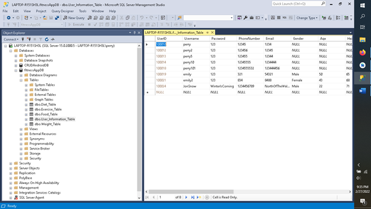

#### Databases Enhancement

For the database enhancement portion of my artifact update, I have added to my fitness tracker application the ability for a user to retrieve and store their data on a remote database.  I have chosen this enhancement because it shows my capability in using SQL as well as some understanding of how to set up and connect to a remote server.

In working on this enhancement, I reinforced my previous learning of using SQL statements, learned how to allow connection to a remote server using my IP address and configuring ports, and learned a little bit about how data server access is controlled.

Although there are still some flaws in my code, I can send and receive data between the mobile application and MS SQL Server.  To begin, I built the entire database using SQL Server Management Studio.  This required that I learn database structure best practices.  All five tables of my database have primary keys and four have foreign keys so that all of the data is linked together.  This prohibits data being stored that does not have a matching entry in a parent table.  Once the database was complete, I built all of the functionality for data transmission between the mobile application and the database server.  This mostly consists of SQL statements.

In order for users to gain access to the server, they also had to have logins and database user accounts created as well as be given read and write permissions.  One major security problem with the current design of the code is that in order to create a new user, a server admin is logged in using their username and password, thus exposing their login credentials.

Currently, only some of the application’s layout activities will run correctly as there are still some bugs being worked out.  However, the user can both locally and remotely store and retrieve their user data, weight data, and exercise data.  The two images below show data being entered using the application and its corresponding database table.

.png)

Overall, I feel that this project shed some light on a previously confusing area of computer science for me.  

[Back to Home Page](/)
